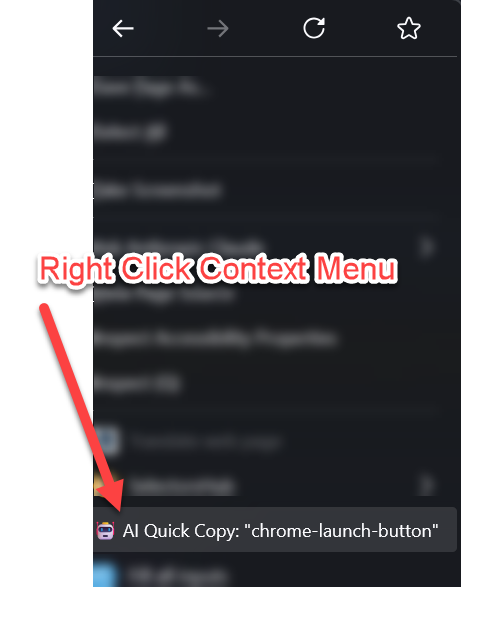

# Useful Browser Extensions

A collection of practical browser extensions designed for developers, coders, and technical professionals who need efficient tools for their daily workflow.

## 🎯 Purpose

This repository contains browser extensions that solve real development problems. Each extension is:
- **Lightweight** - Minimal footprint, maximum efficiency
- **Focused** - Does one thing exceptionally well
- **Developer-friendly** - Built by a developer for developers
- **AI-ready** - Optimized for modern AI-assisted development workflows

## 📦 Extensions

### 1. AI Quick Copy Tool (Firefox & Chrome)

**Problem it solves:** When working with AI assistants (like Claude, ChatGPT, or Copilot) to debug or modify web interfaces, you constantly need to reference specific DOM elements. Opening developer tools, finding the element, and copying its ID breaks your flow.

**Solution:** Right-click any element → "🤖 AI Quick Copy" → Done! The element ID is instantly copied to your clipboard.

*Right-click any element to see the AI Quick Copy option with the element's ID*

**Available for:**
- [Firefox Extension](./copy-element-id-extension/) - Works with Firefox 57+
- [Chrome Extension](./copy-element-id-extension-chrome/) - Works with Chrome 88+, Edge, Brave, and other Chromium browsers

**Key Features:**
- Single-click ID copying directly in context menu (no submenus!)
- Shows actual element ID in the menu label
- Visual confirmation with green notification
- Disabled automatically when element has no ID
- Works on all websites including iframes
- Just the emoji icon - clean and simple

## 🚀 Quick Start

### Firefox
1. Download the `copy-element-id-extension` folder
2. Open Firefox → `about:debugging`
3. Click "This Firefox" → "Load Temporary Add-on"
4. Select `manifest.json`

### Chrome
1. Download the `copy-element-id-extension-chrome` folder
2. Open Chrome → `chrome://extensions/`
3. Enable "Developer mode"
4. Click "Load unpacked" → Select folder

## 👨‍💻 For Developers

These extensions are designed with developers in mind:

- **Clean Code**: Well-commented, maintainable JavaScript
- **Modern APIs**: Uses latest browser extension standards
- **Extensible**: Easy to modify for your specific needs
- **MIT Licensed**: Free to use, modify, and distribute

## 🤝 Contributing

Have an idea for a useful extension? Found a bug? Contributions are welcome!

1. Fork the repository
2. Create your feature branch
3. Commit your changes
4. Push to the branch
5. Open a Pull Request

## ⚡ Use Cases

These extensions are particularly useful when:

- **AI-Assisted Development**: Quickly reference DOM elements when working with AI coding assistants
- **Bug Reporting**: Precisely identify problematic elements
- **Team Communication**: Share exact element references with colleagues
- **Automated Testing**: Get element identifiers for test scripts
- **Documentation**: Reference specific UI components

## 📝 Technical Philosophy

These extensions follow a simple philosophy:

1. **Do One Thing Well**: Each extension has a single, clear purpose
2. **Zero Configuration**: Works immediately after installation
3. **Minimal Permissions**: Only requests necessary browser permissions
4. **Fast & Lightweight**: No unnecessary features or bloat
5. **Developer Time is Valuable**: Save seconds on repetitive tasks

## ⚠️ Disclaimer

These extensions are personal development tools shared with the community. They are provided "as is" without warranty. Use at your own risk. While tested for personal use, they may not cover all edge cases or environments.

## 📄 License

MIT License © 2025 Paul Preibisch

This means you can:
- Use these extensions for any purpose
- Modify the source code
- Distribute your own versions
- Use in commercial projects

See the [LICENSE](./LICENSE) file for full details.

## 🔮 Future Extensions

Planned additions to this collection:
- Quick XPath copier
- CSS selector generator
- Element dimension viewer
- DOM tree navigator
- Accessibility attribute inspector

## 📞 Contact

Created by Paul Preibisch

GitHub: [github.com/paulpreibisch](https://github.com/paulpreibisch)

---

*Built with 🤖 AI assistance for developers who work with AI*